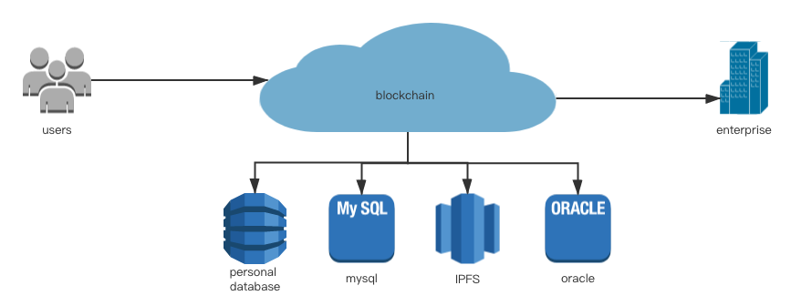

# offchain-storage
See:  frame/offchain-storage

## Introduction
In web3.0, we need to store our data and actually own them, we can swap or sell our data.
But how to guarantee their authenticity in the exchange process?
The answer is that we need store and get data by blockchain.   
However, the blockchain should be more portable so it cannot store all the users’ data, 
so we need to store the data in external storage systems.   
The Offchain-Storage Module will put the metadata of users’ data on chain,
people can use blockchain to store data and in effect the data are stored in any external database they want.  
Anyone want to  get/put/update/delete the data , the blockchain will always record his/her operations and validate the data for them.

## Architecture




## Offchain-Storage Module

### process
- Reading Process: when we read some data from Substrate, the chain will recognize us and get our access.
If we have reading or higher level access,
it will use the data_id to get real data from external storage systems 
and return the real data to us. 
Otherwise the chain will return us a PermissionDenied Error.
- Writing Process: when we write some data (key-value forms) to Substrate, you can choose any storage systems implemented offchain-storage trait that you like. 
Usually, we would store the data into our personal databases. 
Then, the chain will put data into storage systems which we specify and keep the data_id on chain.

### details
The  offchain-storage module has a trait named ExternalStorage for developers.
```
pub trait ExternalStorage {
       fn get(key: Vec<u8>) -> Vec<u8>;
       fn set(key: Vec<u8>, value: Vec<u8>);
       fn delete(key: Vec<u8>);
   }
   ```
   It defines a key-value storage api because every storage form can be compatible with key-value such as table(MySQL), filesystem(IPFS), Neo4j(graph).  
   Developers can implement this trait for any external storage service they need, for example as follows:  
```
	use std::fs;
        use std::fs::File;
        use std::io::prelude::*;
    
    	pub struct DB;
    	
        impl ExternalStorage for DB {
            fn get(key: Vec<u8>) -> Vec<u8> {
                let mut f = File::open(str::from_utf8(key.as_slice()).unwrap()).unwrap();
                let ref mut value: Vec<u8> = Vec::new();
                f.read_to_end(value).unwrap();
                value.to_vec()
            }
    
            fn set(key: Vec<u8>, value: Vec<u8>) {
                let mut f = File::create(str::from_utf8(key.as_slice()).unwrap()).unwrap();
                f.write(value.as_slice()).unwrap();
            }
    
            fn delete(key: Vec<u8>) {
                fs::remove_file(str::from_utf8(key.as_slice()).unwrap()).unwrap();
            }
        }
```

It just use local filesystem to implement a simeple external storage engine. You can also implement a more complex engine.  
The internal data structure in decl_storage is:
```
    Data get(fn get_data): map Vec<u8> => UserData<T::AccountId>;
```
The map **key** is data_id, we need it to identity external data we store.  
The map **value** is UserData, it contains the author and access of data, author has the highest access.  By default, 
 other people just only have reading access.  
 The access have three levels: Avoid, Read, Write.  
 - Avoid means that every one cannot read or write this data except author.  
 - Read means that every one can only read this data.  
 - Write means that every one can write and read this data, author always has this level.

